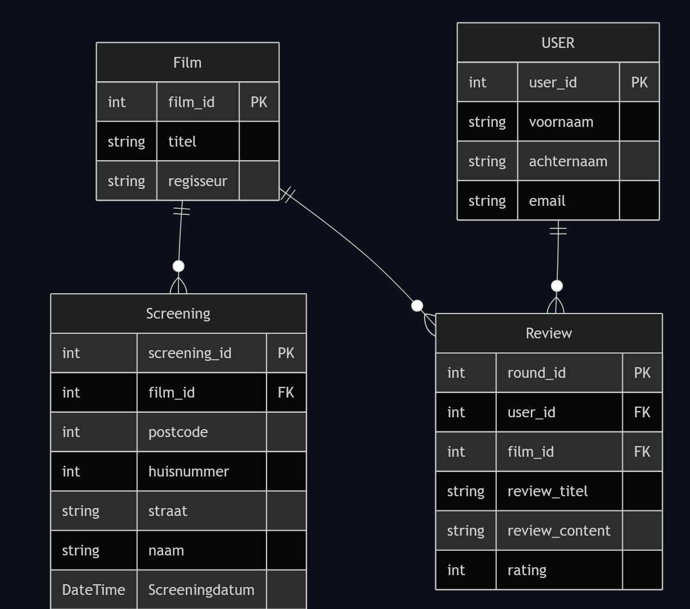
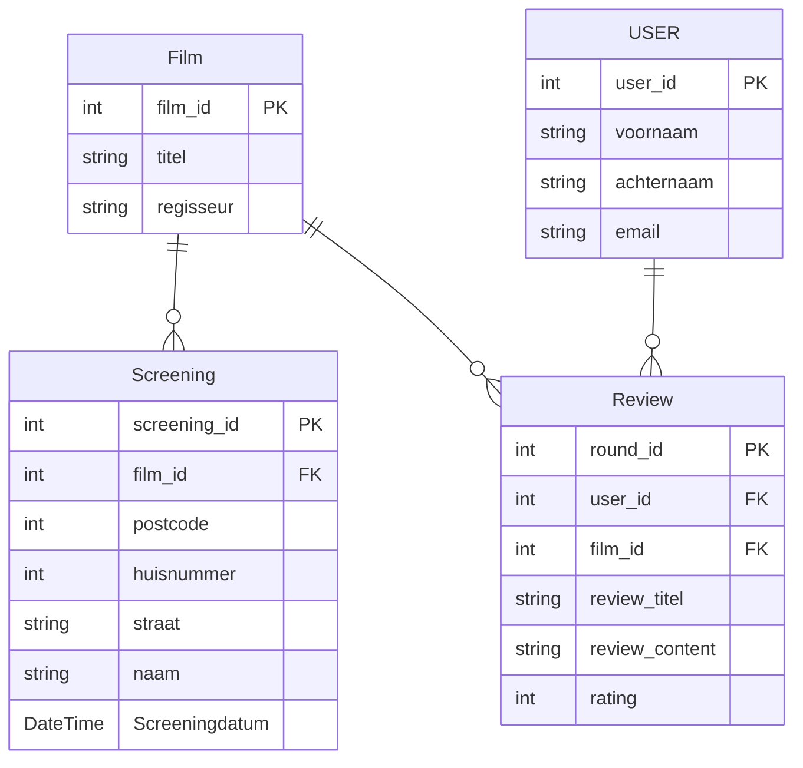

# Dossier

- Student: Anton Verminck
- Studentennummer: 20218723
- E-mailadres: <mailto:anton.verminck@student.hogent.be>
- Demo: <https://hogent.cloud.panopto.eu/Panopto/Pages/Viewer.aspx?id=640a4046-4feb-4351-9a27-b33a01211c87>
- GitHub-repository: <https://github.com/HOGENT-frontendweb/frontendweb-2425-AntonVerminck>
- Web Services:
  - Online versie: <https://webservices-0cc2.onrender.com/>

## Logingegevens

### Lokaal

- email: anton@email.be
- Wachtwoord: 1234678

- email: tom@email.be
- Wachtwoord: 12345678

### Online

- email: anton@email.be
- Wachtwoord: 1234678

- Gebruikersnaam/e-mailadres: tom@email.be
- Wachtwoord: 12345678

## Projectbeschrijving

Mijn project is enkel het backend gedeelte van een Film App, waar er een oplijsting van Films zijn waar users een review kunnen overschrijven en kijken waar en wanneer deze films te zien zijn. Daarnaast dienen deze FilmApp ook om apart ook reviews en screenings te bekijken op een appart gedeelte van de app, dus niet de film. Waar bij informatie over verschillende screenings kan weergegeven worden. Elke tabel is daarom voorzien aan alle CRUD operaties. Als uitbreiding op de voorbeeldapplicatie heb ik dus meerdere eniteiten en relaties voorzien.

## API calls

### Gebruikers

- `GET /api/users`: alle gebruikers ophalen
- `GET /api/users/:id`: gebruiker met een bepaald id ophalen
- `POST /api/films/:id`: gebruiker met een bepaald id ophalen
- `PUT /api/films/:id`: gebruiker met een bepaald id ophalen
- `DELETE /api/films/:id`: gebruiker met een bepaald id ophalen

### Reviews

- `GET /api/reviews`: alle gebruikers ophalen
- `GET /api/reviews/:id`: gebruiker met een bepaald id ophalen
- `GET /api/reviews/:id`: gebruiker met een bepaald id ophalen
- `POST /api/films/:id`: gebruiker met een bepaald id ophalen
- `PUT /api/films/:id`: gebruiker met een bepaald id ophalen
- `DELETE /api/films/:id`: gebruiker met een bepaald id ophalen

### Films

- `GET /api/films`: alle gebruikers ophalen
- `GET /api/films/:id`: gebruiker met een bepaald id ophalen
- `GET /api/films/:id/screenings`: gebruiker met een bepaald id ophalen
- `GET /api/films/:id/reviews`: gebruiker met een bepaald id ophalen
- `POST /api/films/:id`: gebruiker met een bepaald id ophalen
- `PUT /api/films/:id`: gebruiker met een bepaald id ophalen
- `DELETE /api/films/:id`: gebruiker met een bepaald id ophalen

### Screenings

- `GET /api/screenings`: alle gebruikers ophalen
- `GET /api/screenings/:id`: gebruiker met een bepaald id ophalen
- `POST /api/screenings/:id`: gebruiker met een bepaald id ophalen
- `PUT /api/screenings/:id`: gebruiker met een bepaald id ophalen
- `DELETE /api/screenings/:id`: gebruiker met een bepaald id ophalen

### Health

- `GET /api/users`: alle gebruikers ophalen
- `GET /api/users/:id`: gebruiker met een bepaald id ophalen

## Behaalde minimumvereisten

### Web Services

#### Datalaag

- [X] voldoende complex en correct (meer dan één tabel (naast de user tabel), tabellen bevatten meerdere kolommen, 2 een-op-veel of veel-op-veel relaties)
- [X] één module beheert de connectie + connectie wordt gesloten bij sluiten server
- [X] heeft migraties - indien van toepassing
- [X] heeft seeds

#### Repositorylaag

- [X] definieert één repository per entiteit - indien van toepassing
- [X] mapt OO-rijke data naar relationele tabellen en vice versa - indien van toepassing
- [X] er worden kindrelaties opgevraagd (m.b.v. JOINs) - indien van toepassing

#### Servicelaag met een zekere complexiteit

- [X] bevat alle domeinlogica
- [X] er wordt gerelateerde data uit meerdere tabellen opgevraagd
- [X] bevat geen services voor entiteiten die geen zin hebben zonder hun ouder (bv. tussentabellen)
- [X] bevat geen SQL-queries of databank-gerelateerde code

#### REST-laag

- [X] meerdere routes met invoervalidatie
- [X] meerdere entiteiten met alle CRUD-operaties
- [X] degelijke foutboodschappen
- [X] volgt de conventies van een RESTful API
- [X] bevat geen domeinlogica
- [X] geen API calls voor entiteiten die geen zin hebben zonder hun ouder (bv. tussentabellen)
- [X] degelijke autorisatie/authenticatie op alle routes

#### Algemeen

- [X] er is een minimum aan logging en configuratie voorzien
- [X] een aantal niet-triviale én werkende integratietesten (min. 1 entiteit in REST-laag >= 90% coverage, naast de user testen)
- [X] node_modules, .env, productiecredentials... werden niet gepushed op GitHub
- [X] minstens één extra technologie die we niet gezien hebben in de les
- [X] maakt gebruik van de laatste ES-features (async/await, object destructuring, spread operator...)
- [X] de applicatie start zonder problemen op gebruikmakend van de instructies in de README
- [X] de API draait online
- [X] duidelijke en volledige README.md
- [X] er werden voldoende (kleine) commits gemaakt
- [X] volledig en tijdig ingediend dossier

## Projectstructuur

### Web Services

Ik heb de structuur van de voorbeeldapplicatie gevolgd en voor mijn 4 tabellen User, Film, Review, Screening de nodige files gemaakt in de folders, rest, service en types. Hierdoor kunnen de nodige api routes worden opgesteld aangezien elke tabel op zichzelf bereikbaar moet zijn. (niet enkel via "ouder" relaties)

## Extra technologie

### Web Services

De extra technologie is api.doc ivp swagger. Hiervoor moest je tags in commentaar zetten zodat apidoc weet hoe hij deze commentaar omzet naar html en css (yarn apidoc commando), daarnaast moet deze ook toegevoegd worden aan de midleware. 

## Gekende bugs

### Web Services

Neen, geen gekende bugs. Daarnaast wel Engels en Nederlands door elkaar gehaald maar heb gekozen om dit zo te laten.

## Reflectie
Ik ben eigenlijk een laatste jaar student en had dit vak altijd uitgesteld, maar heb er mij deze herexamns aan gezet om deze volledig af te werken.
Eerst wou ik Sequelize gebruiken, maar kreeg dit niet werkende in het eerste semester, voor de herexamens heb ik gekozen om met api doc te werken.
Mogelijke extra's zijn reviews ophalen binnen een bepaalde periode, om recente reviews van verschillende films te tonen.
Het is zeker een vak waar veel tijd in sluipt om naast het volgen van de opzet van de budget app ook zelf volledig te begrijpen wat elke lijn code doet. Allesinds ben ik wel blij dat ik volledig snap wat elke lijn code doet.
